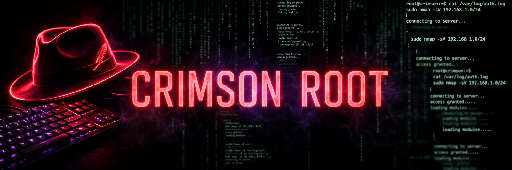

# Curtis Dyess — CRIMSON ROOT
### Artificial Engineer · RHCSA track · one phone bench

> Change the world one day at a time.

> nothing here is a tutorial project. it runs on the bench.

**PythonX** — the decipher. A payload-decoding engine in pure Python, zero dependencies: base64/hex wraps, XOR/ROT/Atbash peels, Vigenère and transposition crackers, an ASL-fingerspelling sign layer, Chinese CJK scoring. Benched live on a Galaxy A16 in Termux.
→ https://github.com/Razor902/pythonx

**The bench** — PhantomX: a phone-first Linux lab. Termux, Tailscale, SSH. The laptop died; the work didn't.

**The rules** — white-hat, permission-only, always. Lab targets only. Service is chosen; slaving is coerced.

**The road** — RHCSA → gray-hat engineer → trauma counselor. The guy that saves the day, one day at a time.

---
*"Believe half of what you see and none of what you hear."* — Marvin Ray McAdams
